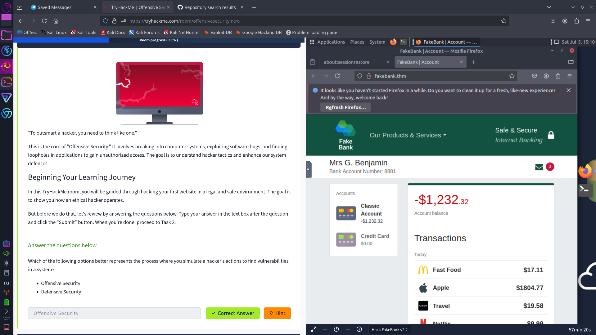
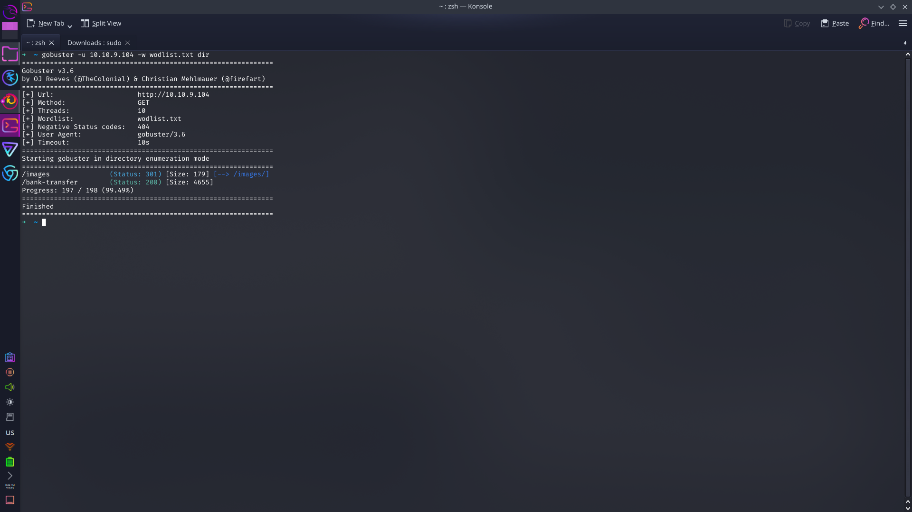
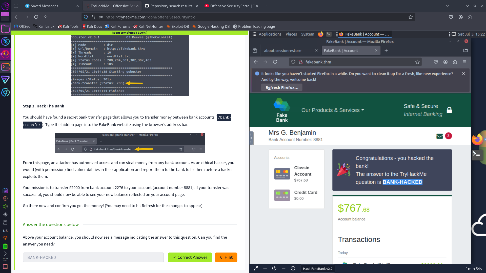

# 🔐 Комната Offensive Security Intro

прохождение комнаты Offensive Security Intro на TryHackMe

---

## 🧱 Начало

**Первый вопрос:**  
Ответ — `Offensive Security`



Когда заходим, у нас нет денег, мы типа в минусе 
Наша задача — **взломать банк**, чтобы получить деньги 💸

---

## 💻 Взлом банка

Дальше надо найти скрытые страницы у банка. Для этого я использовал **gobuster**.

Он помогает брутфорсить — угадывать страницы, которые скрыты от обычных людей.



В итоге я нашёл две страницы, и самая важная из них:  
```
/bank-transfer
```

> ⚠️ Обязательно нужен файл со списком директорий (например, `common.txt`), чтобы gobuster знал, что искать.

---

## 🌐 VPN

Чтобы вообще всё это работало, надо подключиться к машине через **OpenVPN** от TryHackMe. Без этого ничего не будет работать.

---

## 💸 Перевод денег

Когда заходим на страницу [`https://banksip/banktransfer`](https://banksip/banktransfer),  
там можно перевести деньги **с аккаунта 2276 на наш 8881**.  
Нужно перевести **$2000**.

После перевода появляется сообщение:



```
BANK-HACKED
```

🎉 Это и есть ответ на вопрос!

---

## ✅ Всё!

Вот так я прошёл комнату. Было интересно 😎  
Если что-то не получается — проверь VPN и файл со списком директорий.

---

Удачи!
